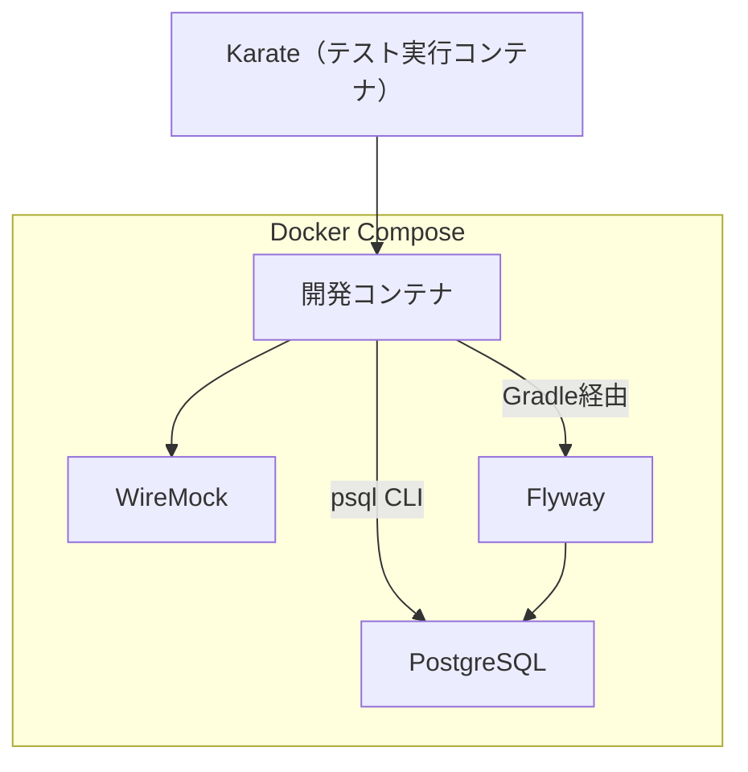

# Kotlin DevContainer

このリポジトリは、Docker Compose と VSCode の DevContainer 機能を活用し、Kotlin の開発環境構築をするためのテンプレートです。<br>
PostgreSQL、Flyway、WireMock、Karate との連携が可能です。

---

## 🚀 含まれるサービス

| サービス名       | 説明                                                                 |
|------------------|----------------------------------------------------------------------|
| Kotlin アプリ    | JDK、Gradle などを含んだ開発用環境                                     |
| PostgreSQL       | バージョン 17.5 のデータベース                                        |
| Flyway           | バージョン 11.9、マイグレーション管理                                 |
| WireMock         | バージョン 3.13.0、API モック環境                                     |
| Karate           | API 自動テスト用フレームワーク。独自の Dockerfile & 実行スクリプトを使用して起動 |

---

## 🛠️ 構成図



---

---

## 📝 スクリプト一覧

このプロジェクトには、開発・実行・メンテナンスを補助するためのスクリプトが含まれています。<br>
すべて `.devcontainer/scripts/` 以下に配置されています。

### 📦 download-kotlin-vsix.sh

`Kotlin LSP（Language Server Protocol）` の VSIX ファイルを指定URLからダウンロードします。<br>
VSCodeで Kotlin の構文補完やエラーチェックを行うために必要です。

- **保存先**：`scripts/devlopment/vsix/`
- **使用方法**：

```bash
bash .devcontainer/scripts/devlopment/download-kotlin-vsix.sh
```


---


### 🧹 docker-clean.sh

Docker に蓄積されたリソース（コンテナ・イメージ・ボリューム・ネットワーク・キャッシュ）を**すべて削除**し、<br>
開発環境をクリーンな状態に戻すスクリプトです。

- **使用方法**：

```bash
bash .devcontainer/scripts/docker/docker-clean.sh
```

### 📄 add-gitignore.sh

指定された `.gitignore` ファイルに、無視したいパスを追加するスクリプトです。

- **使用方法**：

```bash
bash .devcontainer/scripts/git/add-gitignore.sh
```

### 🗂️ copy-ssh-gitconfig.sh

ローカル環境の `~/.ssh` ディレクトリおよび `~/.gitconfig` を `.devcontainer/git/` にコピーするスクリプトです。

- **使用方法**：

```bash
bash .devcontainer/scripts/git/copy-ssh-gitconfig.sh
```

### ⚙️ setup-gitconfig.sh

Git のユーザー名、メールアドレス、GitHub SSH URL の置き換え設定を `.gitconfig` に登録するスクリプトです。

- **使用方法**：

```bash
bash .devcontainer/scripts/git/setup-gitconfig.sh
```

### 🔑 setup-github-ssh.sh

GitHub 用の SSH キーを生成し、GitHub API 経由で公開鍵を登録するスクリプトです。<br>
トークンは `.devcontainer/git/.github-token` に保存されたファイルから読み取ります。

- **使用方法**：

```bash
bash .devcontainer/scripts/git/setup-github-ssh.sh
```

### 🏗️ create-kotlin-project.sh

Kotlin + Gradle の新しいプロジェクトを作成するスクリプトです。<br>
プロジェクト名・パッケージ名・Javaバージョンをもとに `gradle init` を自動実行します。

- **使用方法**：

```bash
bash .devcontainer/scripts/gradle/create-kotlin-project.sh
```

### 🧪 karate-run.sh（+ Dockerfile）

Karate テストを 実行するためのスクリプトです。<br>
対応する `Dockerfile` からKarate の実行環境をビルドし、指定した `.feature` ファイルのテストを実行します。

- **使用方法**：

```bash
bash .devcontainer/scripts/karate/karate-run.sh
```


### 📋 list-wiremock.sh

現在 WireMock に登録されているスタブ（モック）一覧を取得するためのスクリプトです。

- **使用方法**：

```bash
bash .devcontainer/scripts/wiremock/list-wiremock.sh
```

### 🔄 reset-wiremock.sh

WireMock に登録されているすべてのスタブ（モック定義）をリセット（削除）するスクリプトです。

- **使用方法**：

```bash
bash .devcontainer/scripts/wiremock/reset-wiremock.sh
```